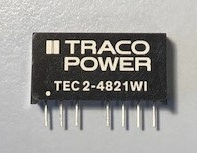
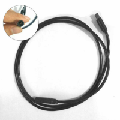
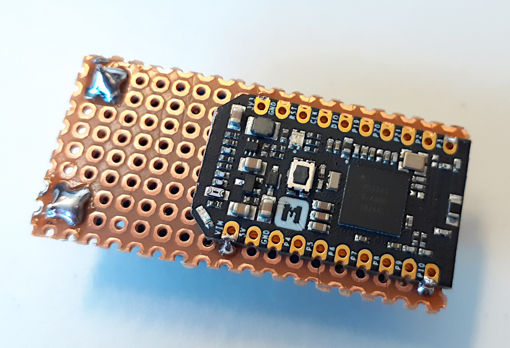
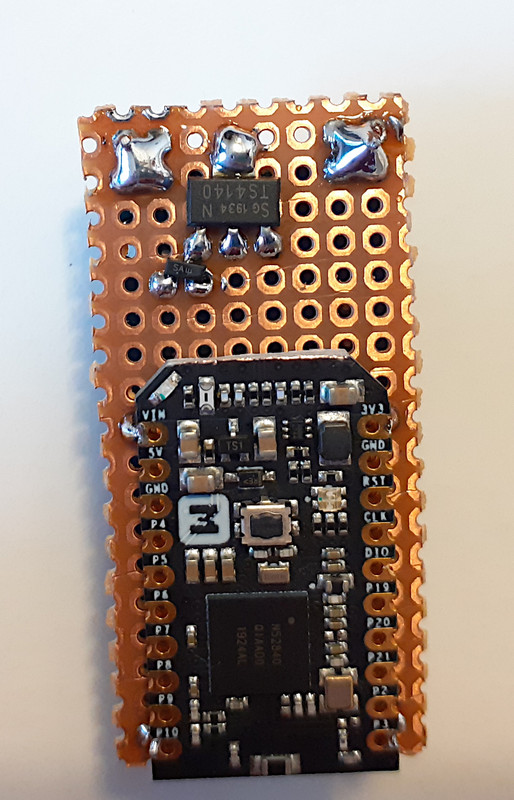
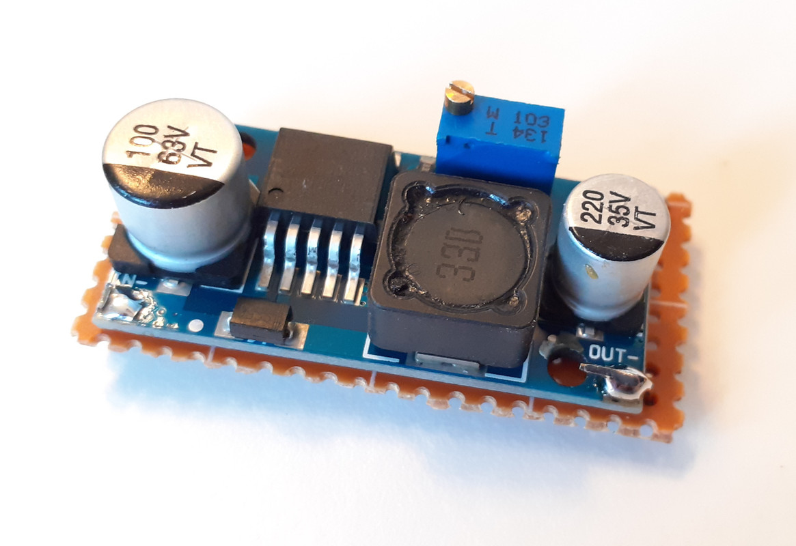
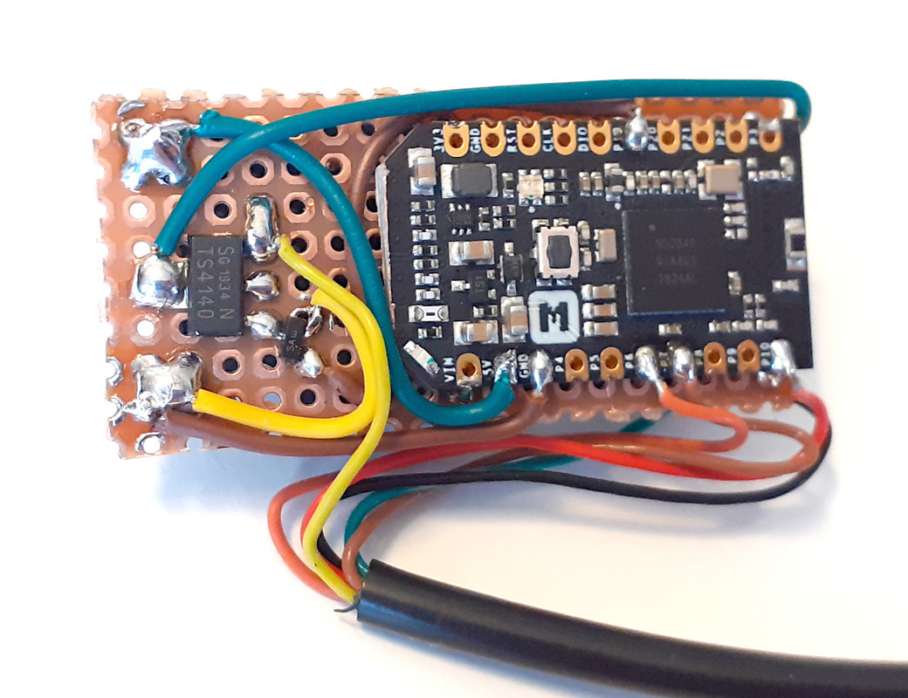
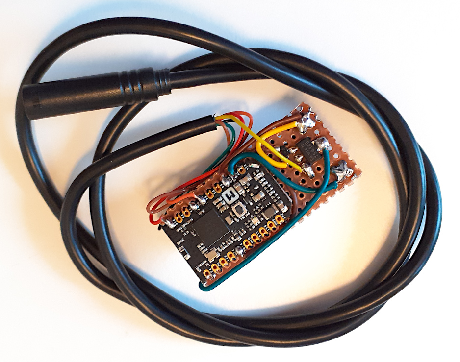
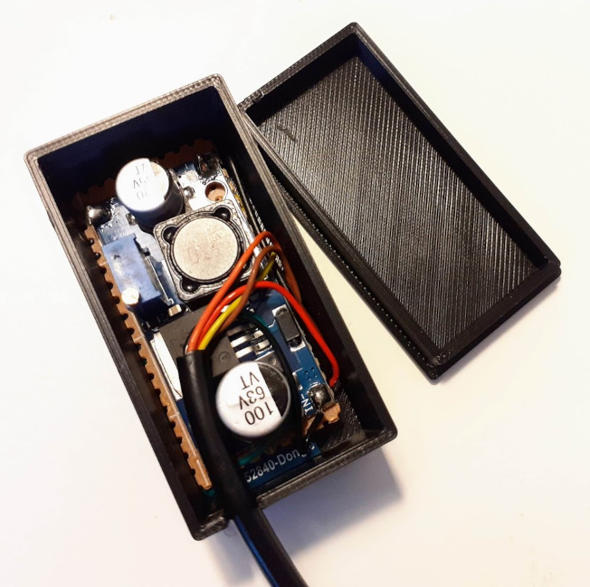

# How to build the TSDZ2 wireless board

You will need the following components:
* **nRF52840 Nordic USB Dongle** 
  
* **60V -> 5V power board - EBike buck dd7818ta 80V -> 5V 1A**: costs 4€ and can be bought in many online shops like EBay, just search for "EBike buck dd7818ta 80". Other DC-DC converters can be used, like the [Traco power TEC-2-4811WI](https://uk.farnell.com/tracopower/tec-2-4811wi/dc-dc-converter-5v-0-4a/dp/2854928). Please note that any DC converter that you choose must have a voltage input of at least 60V and a 5V output.  
EBike buck dd7818ta 80V: 
  
[Traco power TEC-2-4811WI](https://uk.farnell.com/tracopower/tec-2-4811wi/dc-dc-converter-5v-0-4a/dp/2854928): 
  
* **Power switch BTS4140N**: costs 2€, can be bought on EBay or other shops. 
  
* **Transistor BSP296**: costs 2€, can be bought on EBay or other shops. 
  
* **TSDZ2 display extension cable**: costs 6€, can be bought on EBay or other shops. 
  

## Step by step instructions

1 - **Flash bootloader on the nrf52840 board** - see the page: [How to Flash the Wireless Bootloader on a Nordic Dongle](getting_started.md)

2 - **Build your board** - solder all the components following the next schematic. For instance, you can use a [perfboard](https://en.wikipedia.org/wiki/Perfboard) to solder the components and the wires.

2.1 - You can cut your nRF52840 board with a metal saw by hand and this way it will be smaller - here a picture as example:

Schematic:

nrf52840 board pinout:

Pictures of a board that you can take as example - note that the nrf52840 board on the pictures were a different version as also one of the mosfets:

A perfboard were used to keep the nrf52840 board in place as also the mosfets and wires: 

Here the mosfets soldered (note the smaller one is now a different one, with the size of the other): 

And on the other side the DC-DC converter (this is one on the picture is one that need to be adjusted for 5V output - not recommended): 

Now with all the wires and the cable to connect on the TSDZ2 display connector: 

Final assembly: 

And inside of a 3D printed box: 

3 - **Flash firmware on the nrf52840 board** - see the page: [How to Flash the Wireless Remote and Motor Controller Firmware](firmware.md)

4 - **Test** - when the board is powered up and running the firmware, you should see the "TSDZ2" Bluetooth device on your mobile phone.
