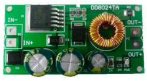

# TSDZ2 Wireless Project Objectives

This project objective is to provide wireless TSDZ2 mid drive motor support for multiple displays, a mobile android app and a wireless remote control, just like the commercial ebikes do, for example, see: [Specialized Turbo Levo Ebike](https://www.youtube.com/watch?v=F43oqj1Zlww).

We have developed [a DIY wireless board](https://github.com/OpenSourceEBike/TSDZ2_wireless/tree/master/EBike_wireless_TSDZ2) to connect to the motor, rather than using a display. The board is small, easy to build and costs only 25€.

With this wireless board alone, you can power on/off the TSDZ2 motor and increase/decrease the assist levels. If you use our mobile app, you will be able to accomplish the same actions and also change the motor configuration.

We also developed [our own DIY wireless remote](https://github.com/OpenSourceEBike/TSDZ2_wireless/tree/master/EBike_wireless_remote), that makes it possible control the motor to power on/off, increase/decrease the assist levels, and display motor battety levels. In addition, it can also connect to a GPS display like a Garmin Edge to change data pages.  
This wireless remote costs only 20€ and the battery will work for about 2.5 years.

## Community help

- Forum message: [EBike wireless standard (like Specialized Turbo Levo) - OpenSource](https://endless-sphere.com/forums/viewtopic.php?t=106346)
- Developers: see [documentation](https://github.com/OpenSourceEBike/TSDZ2_wireless/blob/master/documentation/README.md)

## How to build the TSDZ2 wireless board

You will need to acquire the following components:
* **[Wireless board - nRF52840 Nordic USB Dongle](https://www.nordicsemi.com/Software-and-tools/Development-Kits/nRF52840-Dongle)**: costs 10€ and can be bought in many online shops. 
  
* **60V -> 5V power board - EBike buck dd7818ta 80V -> 5V 1A**: costs 4€ and can be bought in many online shops like EBay, just search for "EBike buck dd7818ta 80". Other DC-DC converters can be used, like the [Traco power TEC-2-4811WI](https://uk.farnell.com/tracopower/tec-2-4811wi/dc-dc-converter-5v-0-4a/dp/2854928). Please note that any DC converter that you choose must have a voltage input of at least 60V and a 5V output.  
  
  
* **Power switch BTS4140N**: costs 2€, can be bought on EBay or other shops. 
  
* **Transistor BSP296**: costs 2€, can be bought on EBay or other shops. 
  
* **TSDZ2 display extension cable**: costs 6€, can be bought on EBay or other shops. 
  

## Schematic

## Firmware Installation

Once you have put the board assembled you are now ready to program the wireless bootloader.
follow the instructions [here](https://github.com/OpenSourceEBike/TSDZ2_wireless/tree/master/EBike_wireless_bootloader).
With the bootloader installed you can now program the Over the Air (OTA) updates for the wireless motor controller located [here](https://github.com/OpenSourceEBike/TSDZ2_wireless/releases)

To program the motor configuration and control the TSDZ2, download and install the android app from here: [https://github.com/OpenSourceEBike/TSDZ2_wireless/releases](https://github.com/OpenSourceEBike/TSDZ2_wireless/releases)

# Wireless remote

## Schematic

## How to build wireless remote
You will need to acquire the following components:
* **[Wireless board - nRF52840 Nordic USB Dongle](https://www.nordicsemi.com/Software-and-tools/Development-Kits/nRF52840-Dongle)**: costs 10€ and can be bought in many online shops. 
  
* **VLCD5 Keypad**: costs 10€, this is the keypad from the TSDZ2 original display. Can be bought in many online shops like EBay". 
  
* **CR2032 coin cell**: costs 1€, can be bought in any local shop or on EBay or other online shops.
*  
   
## Firmware Installation

Once you have put the board assembled you are now ready to program the wireless bootloader.
follow the instructions [here](https://github.com/OpenSourceEBike/TSDZ2_wireless/tree/master/EBike_wireless_bootloader).
With the bootloader installed you can now program the Over the Air (OTA) updates for the wireless remote located [here](https://github.com/OpenSourceEBike/TSDZ2_wireless/releases)