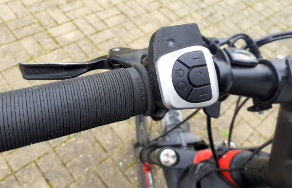
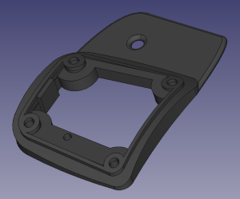
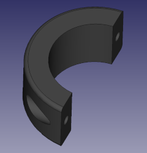
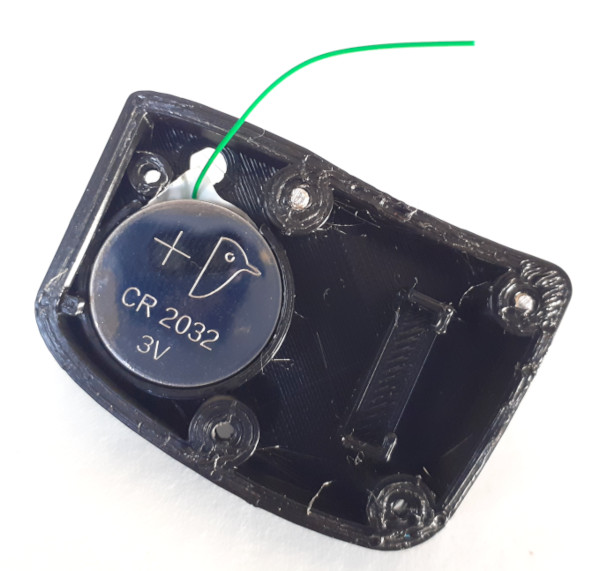
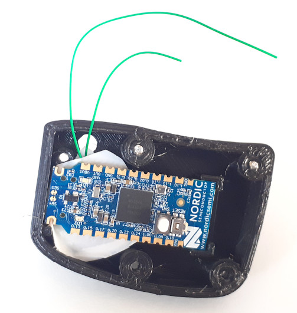
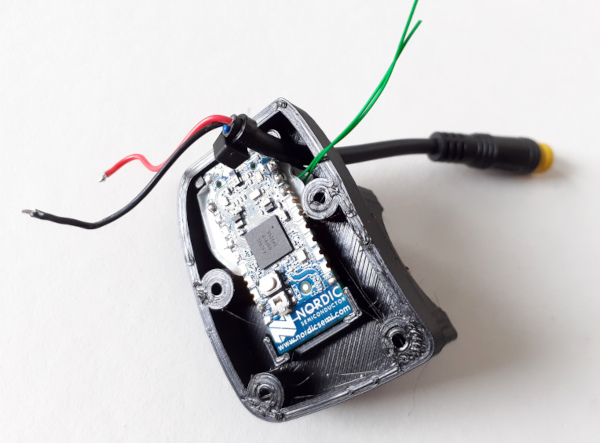
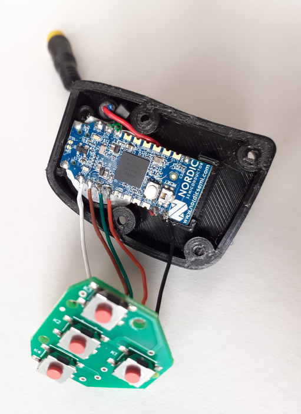
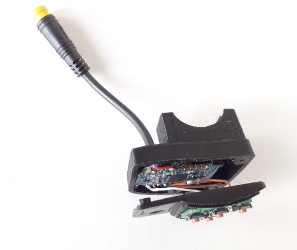
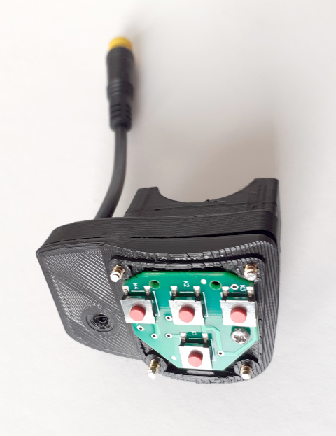
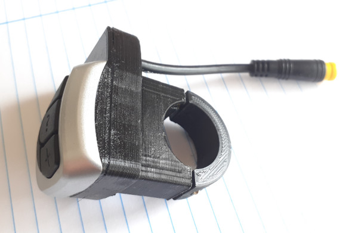

# Wireless remote

This is our wireless remote button for EBikes and/or GPS bike computers like the Garmin Edge. If you do not want to build your own, you can purchase on the market EBike remote controls. ie: the Garmin EBike Remote for about 80€.

However, our wireless remote control is considerably less expensive (costs 20€ in materials) and offers several additional features for EBike control.

Features:
* turn on/off the motor
* increase/decrease assist level
* turn on/off walk assist
* turn on/off lights
* show battery level
* send the brake signal
* RGB LED to provide visual feedback
* battery should last for more than 2 years
* Garmin Edge page change 

 Pictures of our remote that reuses the VLCD5 keypad and also includes and a cable with connector for the brake sensor: 

Installed on the handle bard: 

 

# How to build the wireless remote

You will need the following components:
* **nRF52840 Nordic USB Dongle** 
  
* **VLCD5 display keypad or 860C display keypad**: costs 10€, this is the keypad from the TSDZ2 original display. Can be bought in many online shops like EBay. 
  
* **CR2032 coin cell**: costs 1€, can be bought in any local shop or on EBay or other online shops.
 
  

* **screw M2x12mm**: six screws M2x12mm 0.79mm pitch. You can buy on EBay, search for "Phillips Pan Head Thread Cutting Self Tapping Screw M2" 

* **3D printed enclosure**: NOTE that if you do not have a 3D printer, you can improvise by simple use some black tape to protect the board, wires and the battery. If you 3D print this enclosure, it should costs about 1€. 

Optional components:
* **Cable with 2 pins and water prof connector**: costs 4.5€, with a good connector used on EBikes, to connect to the brake sensors. Can be bought in many online shops like EBay - search for "julet mini connector" or "higo connector" and choose the 2 pin male and female, red color. 

## Step by step instructions

1 - **Flash bootloader on the nrf52840 board** - see the page: [How to Flash the Wireless Bootloader on a Nordic Dongle](../getting_started.md)

2 - **Build your board** - solder all the wires following the next schematic.

Cut your nRF52840 board with a metal saw by hand, this way the board will be smaller and ready to be placed on the 3D printed box - here a picture as example:

Do not solder any wires to the battery, it would be dangerous. Simple use the wires against the battery and use same tape to get them in place. In the end you can use some little sponge to make pressure on so they will have a good contact with the battery.

Schematic:

nrf52840 board pinout:

You MUST cut the SB2 and solder the SB1 pads on the bottom of the board:

3 - **Build your enclosure** - 3D print the enclosure and assembly.

3D print the following 3 STL files (can be printed in PLA and at 0.2mm layer height):
  * [top_part.stl](top_part.stl) 
   
  * [lower_part.stl](lower_part.stl) 
   
  * [clamp_part.stl](clamp_part.stl) 
   

Assembly:

Use thin wires to make contact with the CRC2032 battery. Use tape to keep the wires in place - the contact will be guaranteed when in the final you put a little sponge to keep constant pressure between the wires and the battery: 
 

The tape here is crucial to also isolate the bottom of the wireless board from making contact with the battery: 
 

You can block the brake wire with a small zip tie, so it will be hard to pull it out: 
 

 

Here is hard to see but the battery thin wires are already soldered to the wireless board. The brake wires were placed under the board so they are not visible. All the wires are soldered: 
 

There is 1mm gap or more to accommodate the wires: 
 

Now the 4 M2x12mm screws. There is other screw not visible but is a screw from the VLCD5 remote:
 

 

And the final result. I used translucent silicone to close the LED hole and on all parts where the water could get inside so my remote is water prof:
 

4 - **Flash firmware on the nrf52840 board** - see the page: [How to Flash the Wireless Remote and Motor Controller Firmware](../firmware.md)

5 - **Test** - Make sure the TSDZ2 wireless board if off. Power up the remote board and the firmware will blink the LED (LD2) with red color.
